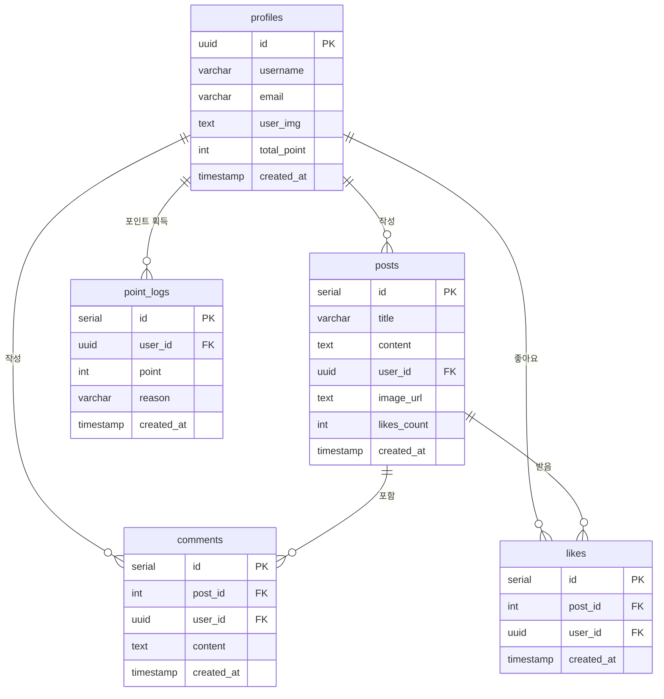

# Database Schema

## 📋 목차
- [개요](#개요)
- [테이블 구조](#테이블-구조)
- [관계도](#관계도)
- [Supabase RPC 함수](#supabase-rpc-함수)
- [인덱스](#인덱스)
- [마이그레이션 가이드](#마이그레이션-가이드)

---

## 개요

Zeroro는 **Supabase**(PostgreSQL)를 데이터베이스로 사용합니다.

### 데이터베이스 정보

- **Provider**: Supabase (PostgreSQL 15+)
- **Connection**: Supabase Python Client 사용
- **Authentication**: Supabase Anon Key

---

## 테이블 구조

### 1. `profiles` (사용자 프로필)

사용자 정보를 저장하는 테이블

| 컬럼명 | 타입 | 제약조건 | 설명 |
|--------|------|----------|------|
| `id` | UUID | PRIMARY KEY | 사용자 ID (Supabase Auth와 연동) |
| `username` | VARCHAR | NOT NULL | 사용자 이름 |
| `email` | VARCHAR | UNIQUE, NOT NULL | 이메일 주소 |
| `user_img` | TEXT | | 프로필 이미지 URL |
| `total_point` | INTEGER | DEFAULT 0 | 총 포인트 |
| `created_at` | TIMESTAMP | DEFAULT NOW() | 생성 시간 |
| `updated_at` | TIMESTAMP | DEFAULT NOW() | 수정 시간 |

**인덱스**:
- `PRIMARY KEY (id)`
- `UNIQUE INDEX (email)`

---

### 2. `posts` (게시글)

커뮤니티 게시글을 저장하는 테이블

| 컬럼명 | 타입 | 제약조건 | 설명 |
|--------|------|----------|------|
| `id` | SERIAL | PRIMARY KEY | 게시글 ID |
| `title` | VARCHAR(255) | NOT NULL | 게시글 제목 |
| `content` | TEXT | NOT NULL | 게시글 내용 |
| `user_id` | UUID | FOREIGN KEY (profiles.id) | 작성자 ID |
| `image_url` | TEXT | | 이미지 URL (선택) |
| `likes_count` | INTEGER | DEFAULT 0 | 좋아요 수 |
| `created_at` | TIMESTAMP | DEFAULT NOW() | 생성 시간 |
| `updated_at` | TIMESTAMP | DEFAULT NOW() | 수정 시간 |

**인덱스**:
- `PRIMARY KEY (id)`
- `INDEX (user_id)`
- `INDEX (created_at DESC)` - 최신순 정렬용

**Foreign Keys**:
- `user_id` REFERENCES `profiles(id)` ON DELETE CASCADE

---

### 3. `comments` (댓글)

게시글 댓글을 저장하는 테이블

| 컬럼명 | 타입 | 제약조건 | 설명 |
|--------|------|----------|------|
| `id` | SERIAL | PRIMARY KEY | 댓글 ID |
| `post_id` | INTEGER | FOREIGN KEY (posts.id) | 게시글 ID |
| `user_id` | UUID | FOREIGN KEY (profiles.id) | 작성자 ID |
| `content` | TEXT | NOT NULL | 댓글 내용 |
| `created_at` | TIMESTAMP | DEFAULT NOW() | 생성 시간 |
| `updated_at` | TIMESTAMP | DEFAULT NOW() | 수정 시간 |

**인덱스**:
- `PRIMARY KEY (id)`
- `INDEX (post_id, created_at)` - 게시글별 댓글 조회용

**Foreign Keys**:
- `post_id` REFERENCES `posts(id)` ON DELETE CASCADE
- `user_id` REFERENCES `profiles(id)` ON DELETE CASCADE

---

### 4. `likes` (좋아요)

게시글 좋아요 정보를 저장하는 테이블

| 컬럼명 | 타입 | 제약조건 | 설명 |
|--------|------|----------|------|
| `id` | SERIAL | PRIMARY KEY | 좋아요 ID |
| `post_id` | INTEGER | FOREIGN KEY (posts.id) | 게시글 ID |
| `user_id` | UUID | FOREIGN KEY (profiles.id) | 사용자 ID |
| `created_at` | TIMESTAMP | DEFAULT NOW() | 생성 시간 |

**인덱스**:
- `PRIMARY KEY (id)`
- `UNIQUE INDEX (user_id, post_id)` - 중복 좋아요 방지
- `INDEX (post_id)` - 게시글별 좋아요 조회용

**Foreign Keys**:
- `post_id` REFERENCES `posts(id)` ON DELETE CASCADE
- `user_id` REFERENCES `profiles(id)` ON DELETE CASCADE

---

### 5. `point_logs` (포인트 로그)

사용자 포인트 획득 기록을 저장하는 테이블

| 컬럼명 | 타입 | 제약조건 | 설명 |
|--------|------|----------|------|
| `id` | SERIAL | PRIMARY KEY | 로그 ID |
| `user_id` | UUID | FOREIGN KEY (profiles.id) | 사용자 ID |
| `point` | INTEGER | NOT NULL | 획득/차감 포인트 |
| `reason` | VARCHAR(255) | | 포인트 획득 이유 (선택) |
| `created_at` | TIMESTAMP | DEFAULT NOW() | 생성 시간 |

**인덱스**:
- `PRIMARY KEY (id)`
- `INDEX (user_id, created_at DESC)` - 사용자별 로그 조회용
- `INDEX (created_at)` - 날짜별 집계용

**Foreign Keys**:
- `user_id` REFERENCES `profiles(id)` ON DELETE CASCADE

---

### 6. `leaderboard` (리더보드)

리더보드 순위 정보 (또는 Materialized View)

| 컬럼명 | 타입 | 제약조건 | 설명 |
|--------|------|----------|------|
| `user_id` | UUID | PRIMARY KEY | 사용자 ID |
| `total_point` | INTEGER | | 총 포인트 |
| `rank` | INTEGER | | 순위 |
| `updated_at` | TIMESTAMP | | 마지막 업데이트 시간 |

**Note**:
- `profiles` 테이블의 `total_point`를 기반으로 계산됩니다.
- Materialized View 또는 주기적으로 갱신되는 테이블일 수 있습니다.

---

## 관계도

```
profiles (사용자)
    ├─1:N─→ posts (게시글)
    ├─1:N─→ comments (댓글)
    ├─1:N─→ likes (좋아요)
    └─1:N─→ point_logs (포인트 로그)

posts (게시글)
    ├─1:N─→ comments (댓글)
    └─1:N─→ likes (좋아요)
```

### ER Diagram (Mermaid)



---

## Supabase RPC 함수

RPC(Remote Procedure Call) 함수는 데이터베이스 레벨에서 실행되는 저장 프로시저입니다.

### 1. `increment_likes(post_id INT)`

게시글 좋아요 수를 원자적으로 증가시킵니다.

**SQL 정의** (Supabase SQL Editor에서 생성):
```sql
CREATE OR REPLACE FUNCTION increment_likes(post_id INT)
RETURNS VOID AS $$
BEGIN
  UPDATE posts
  SET likes_count = likes_count + 1
  WHERE id = post_id;
END;
$$ LANGUAGE plpgsql;
```

**호출 방법** (Python):
```python
supabase.rpc("increment_likes", {"post_id": 1}).execute()
```

**사용처**:
- `LikeService.create_like()` - 좋아요 추가 시

---

### 2. `decrement_likes(post_id INT)`

게시글 좋아요 수를 원자적으로 감소시킵니다.

**SQL 정의**:
```sql
CREATE OR REPLACE FUNCTION decrement_likes(post_id INT)
RETURNS VOID AS $$
BEGIN
  UPDATE posts
  SET likes_count = GREATEST(likes_count - 1, 0)
  WHERE id = post_id;
END;
$$ LANGUAGE plpgsql;
```

**Notes**:
- `GREATEST(likes_count - 1, 0)`: 음수 방지

**호출 방법** (Python):
```python
supabase.rpc("decrement_likes", {"post_id": 1}).execute()
```

**사용처**:
- `LikeService.delete_like()` - 좋아요 삭제 시

---

### 3. `update_user_total_point(user_id UUID, point_delta INT)` (추가 권장)

사용자 총 포인트를 원자적으로 업데이트합니다.

**SQL 정의** (권장):
```sql
CREATE OR REPLACE FUNCTION update_user_total_point(
  user_id UUID,
  point_delta INT
)
RETURNS VOID AS $$
BEGIN
  UPDATE profiles
  SET total_point = GREATEST(total_point + point_delta, 0)
  WHERE id = user_id;
END;
$$ LANGUAGE plpgsql;
```

**사용처**:
- `PointService.create_point_log()` - 포인트 로그 생성 시

---

## 인덱스

### 성능 최적화를 위한 인덱스

```sql
-- posts 테이블
CREATE INDEX idx_posts_user_id ON posts(user_id);
CREATE INDEX idx_posts_created_at ON posts(created_at DESC);

-- comments 테이블
CREATE INDEX idx_comments_post_id ON comments(post_id, created_at);
CREATE INDEX idx_comments_user_id ON comments(user_id);

-- likes 테이블
CREATE UNIQUE INDEX idx_likes_user_post ON likes(user_id, post_id);
CREATE INDEX idx_likes_post_id ON likes(post_id);

-- point_logs 테이블
CREATE INDEX idx_point_logs_user_created ON point_logs(user_id, created_at DESC);
CREATE INDEX idx_point_logs_created_at ON point_logs(created_at);
```

---

## 트리거 (Triggers)

### 1. `updated_at` 자동 업데이트

모든 테이블의 `updated_at` 컬럼을 자동으로 업데이트합니다.

```sql
-- 트리거 함수 생성
CREATE OR REPLACE FUNCTION update_updated_at_column()
RETURNS TRIGGER AS $$
BEGIN
  NEW.updated_at = NOW();
  RETURN NEW;
END;
$$ LANGUAGE plpgsql;

-- 각 테이블에 트리거 적용
CREATE TRIGGER update_profiles_updated_at
  BEFORE UPDATE ON profiles
  FOR EACH ROW
  EXECUTE FUNCTION update_updated_at_column();

CREATE TRIGGER update_posts_updated_at
  BEFORE UPDATE ON posts
  FOR EACH ROW
  EXECUTE FUNCTION update_updated_at_column();

CREATE TRIGGER update_comments_updated_at
  BEFORE UPDATE ON comments
  FOR EACH ROW
  EXECUTE FUNCTION update_updated_at_column();
```

---

## Row Level Security (RLS)

Supabase는 RLS를 통해 데이터 접근을 제어할 수 있습니다. (선택사항)

### 예시: posts 테이블 RLS

```sql
-- RLS 활성화
ALTER TABLE posts ENABLE ROW LEVEL SECURITY;

-- 정책: 모든 사용자가 게시글 읽기 가능
CREATE POLICY "Anyone can read posts"
  ON posts FOR SELECT
  USING (true);

-- 정책: 본인의 게시글만 수정 가능
CREATE POLICY "Users can update their own posts"
  ON posts FOR UPDATE
  USING (auth.uid() = user_id);

-- 정책: 본인의 게시글만 삭제 가능
CREATE POLICY "Users can delete their own posts"
  ON posts FOR DELETE
  USING (auth.uid() = user_id);
```

---

## 마이그레이션 가이드

### Supabase에서 테이블 생성

Supabase Dashboard → SQL Editor에서 다음 SQL을 실행:

```sql
-- 1. profiles 테이블 (Supabase Auth와 연동)
CREATE TABLE IF NOT EXISTS profiles (
  id UUID PRIMARY KEY REFERENCES auth.users(id) ON DELETE CASCADE,
  username VARCHAR(255) NOT NULL,
  email VARCHAR(255) UNIQUE NOT NULL,
  user_img TEXT,
  total_point INTEGER DEFAULT 0,
  created_at TIMESTAMP DEFAULT NOW(),
  updated_at TIMESTAMP DEFAULT NOW()
);

-- 2. posts 테이블
CREATE TABLE IF NOT EXISTS posts (
  id SERIAL PRIMARY KEY,
  title VARCHAR(255) NOT NULL,
  content TEXT NOT NULL,
  user_id UUID REFERENCES profiles(id) ON DELETE CASCADE,
  image_url TEXT,
  likes_count INTEGER DEFAULT 0,
  created_at TIMESTAMP DEFAULT NOW(),
  updated_at TIMESTAMP DEFAULT NOW()
);

-- 3. comments 테이블
CREATE TABLE IF NOT EXISTS comments (
  id SERIAL PRIMARY KEY,
  post_id INTEGER REFERENCES posts(id) ON DELETE CASCADE,
  user_id UUID REFERENCES profiles(id) ON DELETE CASCADE,
  content TEXT NOT NULL,
  created_at TIMESTAMP DEFAULT NOW(),
  updated_at TIMESTAMP DEFAULT NOW()
);

-- 4. likes 테이블
CREATE TABLE IF NOT EXISTS likes (
  id SERIAL PRIMARY KEY,
  post_id INTEGER REFERENCES posts(id) ON DELETE CASCADE,
  user_id UUID REFERENCES profiles(id) ON DELETE CASCADE,
  created_at TIMESTAMP DEFAULT NOW(),
  UNIQUE(user_id, post_id)
);

-- 5. point_logs 테이블
CREATE TABLE IF NOT EXISTS point_logs (
  id SERIAL PRIMARY KEY,
  user_id UUID REFERENCES profiles(id) ON DELETE CASCADE,
  point INTEGER NOT NULL,
  reason VARCHAR(255),
  created_at TIMESTAMP DEFAULT NOW()
);

-- 인덱스 생성
CREATE INDEX idx_posts_user_id ON posts(user_id);
CREATE INDEX idx_posts_created_at ON posts(created_at DESC);
CREATE INDEX idx_comments_post_id ON comments(post_id, created_at);
CREATE INDEX idx_likes_user_post ON likes(user_id, post_id);
CREATE INDEX idx_point_logs_user_created ON point_logs(user_id, created_at DESC);

-- RPC 함수 생성
CREATE OR REPLACE FUNCTION increment_likes(post_id INT)
RETURNS VOID AS $$
BEGIN
  UPDATE posts SET likes_count = likes_count + 1 WHERE id = post_id;
END;
$$ LANGUAGE plpgsql;

CREATE OR REPLACE FUNCTION decrement_likes(post_id INT)
RETURNS VOID AS $$
BEGIN
  UPDATE posts SET likes_count = GREATEST(likes_count - 1, 0) WHERE id = post_id;
END;
$$ LANGUAGE plpgsql;
```

---

## 데이터 백업 및 복원

### 백업

Supabase Dashboard → Database → Backups

또는 CLI:
```bash
pg_dump -h db.xxx.supabase.co -U postgres -d postgres > backup.sql
```

### 복원

```bash
psql -h db.xxx.supabase.co -U postgres -d postgres < backup.sql
```

---

## 추가 고려사항

### 1. Soft Delete

삭제된 데이터를 보관하려면 `deleted_at` 컬럼 추가:

```sql
ALTER TABLE posts ADD COLUMN deleted_at TIMESTAMP;

-- 삭제 시
UPDATE posts SET deleted_at = NOW() WHERE id = 1;

-- 조회 시 (deleted_at이 NULL인 것만)
SELECT * FROM posts WHERE deleted_at IS NULL;
```

### 2. 전체 텍스트 검색 (Full-Text Search)

게시글 검색을 위한 FTS 인덱스:

```sql
-- tsvector 컬럼 추가
ALTER TABLE posts ADD COLUMN search_vector tsvector;

-- 인덱스 생성
CREATE INDEX idx_posts_search ON posts USING GIN(search_vector);

-- 트리거로 자동 업데이트
CREATE TRIGGER posts_search_update
  BEFORE INSERT OR UPDATE ON posts
  FOR EACH ROW EXECUTE FUNCTION
  tsvector_update_trigger(search_vector, 'pg_catalog.simple', title, content);
```

---

## 참고 자료

- [Supabase 공식 문서](https://supabase.com/docs)
- [PostgreSQL 공식 문서](https://www.postgresql.org/docs/)
- [Supabase Python Client](https://supabase.com/docs/reference/python/introduction)
